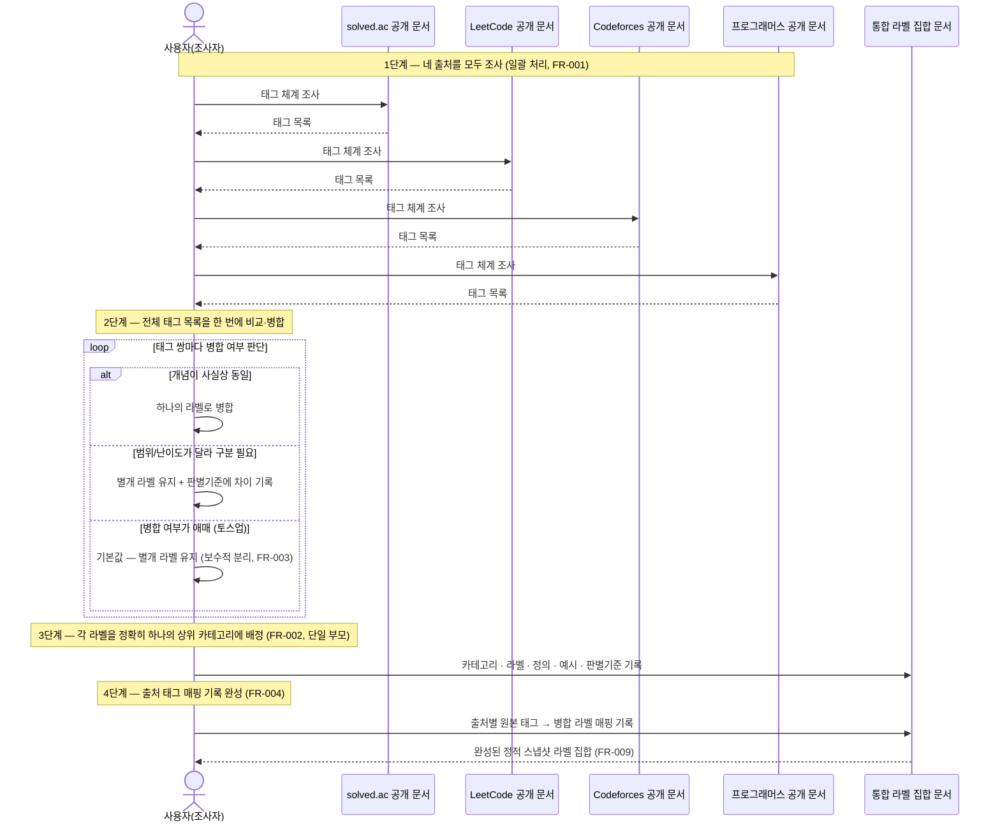

# Feature Specification: 알고리즘 문제 라벨 통합 분류체계(Taxonomy) 구축

**Feature Branch**: `001-algorithm-label-taxonomy`

**Created**: 2026-07-22

**Status**: Draft

**Input**: User description: ".specify/assessments/algorithm-problem-labeling의 decision.md·concept.md 핸드오프 — 여러 공신력 있는 출처(solved.ac, LeetCode, Codeforces, 프로그래머스)의 공개 문서를 조사해 병합한, 정의·예시·판별기준을 갖춘 상위/하위 2단계 라벨 집합을 만든다."

## Clarifications

### Session 2026-07-22

- Q: 라벨과 상위 카테고리의 관계는 단일 부모인가, 다중 부모를 허용하는가? → A: 라벨은 정확히 하나의 상위 카테고리에만 속한다 (단일 부모).
- Q: 네 출처를 조사·병합하는 절차는 일괄 처리인가, 출처별 점진 병합인가? → A: 네 출처를 모두 먼저 전부 조사(태그 목록화)한 뒤, 한 번에 전체를 비교·병합한다 (일괄 처리).
- Q: 두 태그를 병합할지 별개로 둘지 판단이 진짜로 애매(토스업)할 때 기본 규칙은? → A: 애매하면 기본적으로 별개 라벨로 유지하고, 판별기준에 "명확히 구분하기 어려움"을 명시한다 (보수적 분리).
- Q: 실제 조사 결과 solved.ac 태그가 약 250개 이상(상위권 대회 전용 고급 기법 다수 포함), LeetCode가 약 70개로 사전 예상(20~40개대)보다 훨씬 많음이 확인됨 — 전량을 그대로 병합할지, 범위를 좁힐지? → A: 범위를 좁혀서 전체 진행한다. 취업·코딩테스트·일반 알고리즘 학습에 실질적으로 쓰이는 태그만 라벨로 채택하고, ICPC/IOI 등 최상위권 대회 전용 고급 기법(예: `berlekamp_massey`, `splay_tree`, `voronoi`, `dancing_links` 등)은 이번 라벨 집합에서 제외한다. 최종 라벨 규모는 대략 50~80개 수준을 목표로 한다.

**조사·병합 절차 흐름도** (위 세 답변 — FR-001 일괄 처리, FR-002 단일 부모, FR-003 보수적 분리 — 를 하나의 흐름으로 정리):

## User Scenarios & Testing *(mandatory)*

### User Story 1 - 통합 라벨 집합으로 학습 계획 세우기 (Priority: P1)

개인 학습자인 사용자는 여러 출처를 따로 오가지 않고, 하나의 통합된 라벨 집합 문서만 보고 어떤 알고리즘 유형들이 있는지, 각 유형이 무엇을 의미하는지 파악하여 학습 순서를 계획하고 싶다.

**Why this priority**: 이 기능의 핵심 존재 이유. 이 산출물이 없으면 나머지 시나리오(판별, 추적)도 의미가 없다.

**Independent Test**: 라벨 집합 문서 하나만 열람하는 것으로, 상위 카테고리 목록과 각 카테고리에 속한 하위 태그 목록, 그리고 각 하위 태그의 정의를 확인할 수 있는지로 검증 가능.

**Acceptance Scenarios**:

1. **Given** 완성된 라벨 집합 문서, **When** 사용자가 문서를 연다, **Then** 상위 카테고리(예: 자료구조, 그래프, 탐색, DP 등)와 각 카테고리에 속한 하위 태그 목록이 계층 구조로 표시된다.
2. **Given** 임의의 하위 태그, **When** 사용자가 해당 태그 항목을 읽는다, **Then** 이름, 정의, 대표 예시, 판별기준이 모두 포함되어 있다.

---

### User Story 2 - 비슷한 라벨 간 구분하기 (Priority: P2)

사용자는 서로 다른 출처에서 유래했지만 이름이나 개념이 비슷한 두 라벨(예: 서로 다른 출처의 "이분 탐색" 관련 태그들)을 마주쳤을 때, 이 둘이 실제로 같은 개념으로 병합된 것인지 혹은 별개 라벨로 남아있는 것인지, 남아있다면 무엇이 다른지 판별기준을 통해 이해하고 싶다.

**Why this priority**: 여러 출처 병합의 핵심 난제(개념 중복/유사 판단)가 사용자에게 실제로 유용하려면 판별기준이 실사용 가능해야 한다. P1이 갖춰진 뒤에 검증 가능한 심화 시나리오.

**Independent Test**: 서로 유사한 이름의 하위 태그 두 개를 골라, 각각의 판별기준 항목만 읽고 두 라벨의 차이를 설명할 수 있는지로 검증 가능.

**Acceptance Scenarios**:

1. **Given** 개념상 유사한 하위 태그 두 개, **When** 사용자가 각 라벨의 판별기준을 읽는다, **Then** 두 라벨이 어떤 기준으로 구분되는지 알 수 있다.

---

### User Story 3 - 원본 출처 태그 대비 누락 여부 확인하기 (Priority: P3)

사용자는 조사 대상 네 출처(solved.ac, LeetCode, Codeforces, 프로그래머스) 각각의 원래 태그 체계에 있던 태그가 통합 라벨 집합의 어느 라벨로 흡수되었는지 추적하여, 병합 과정에서 빠뜨린 태그가 없는지 스스로 확인하고 싶다.

**Why this priority**: 포괄성(완전성) 검증은 라벨 집합의 신뢰도를 뒷받침하지만, 학습 계획 수립(P1)이나 실사용(P2)에 비해 검증 빈도가 낮은 부가 시나리오.

**Independent Test**: 임의의 출처 하나를 골라, 그 출처의 원본 태그 목록과 라벨 집합 문서에 기록된 "출처 태그 → 병합 라벨" 매핑을 대조하여 누락된 원본 태그가 없는지 확인 가능.

**Acceptance Scenarios**:

1. **Given** 네 출처 중 하나의 원본 태그 목록, **When** 사용자가 라벨 집합 문서의 매핑 기록을 조회한다, **Then** 원본 태그 각각이 어느 병합 라벨에 대응하는지 확인할 수 있다.

---

### Edge Cases

- 라벨 집합이 만들어진 이후 원본 출처의 태그 체계가 바뀌면 어떻게 하는가? (완성 기준은 조사 시점 기준 정적 스냅샷이므로, 이후 변경사항 반영은 이번 기능 범위 밖의 별도 후속 작업으로 다룬다.)
- 한 출처의 태그가 기존 상위 카테고리 어디에도 자연스럽게 속하지 않을 때 어떻게 하는가? (새 상위 카테고리 신설 또는 기존 카테고리 확장 여부를 매핑 기록에 근거와 함께 남긴다.)
- 여러 출처의 태그가 이름은 다르지만 개념이 사실상 동일할 때 어떻게 병합하는가? (하나의 라벨로 합치고, 각 출처의 원래 이름을 매핑 기록에 남긴다.)
- 여러 출처의 태그가 이름은 비슷하지만 범위나 난이도가 달라 완전히 합칠 수 없을 때 어떻게 하는가? (별개 라벨로 유지하고 판별기준에 그 차이를 명시한다.)
- 두 태그를 병합할지 별개로 둘지 판단이 진짜로 애매(토스업)할 때 어떻게 하는가? (기본적으로 별개 라벨로 유지하는 보수적 분리를 원칙으로 하고, 판별기준에 "명확히 구분하기 어려움"을 명시한다.)
- 대표 예시로 쓸 문제가 지역 제한·로그인 필요 등으로 누구나 확인하긴 어려울 때 어떻게 하는가? (이름·출처·링크만 기록하며, 원문 내용 자체는 포함하지 않으므로 접근성 문제와 무관하게 참조로서는 유효하다.)

## Requirements *(mandatory)*

### Functional Requirements

- **FR-001**: 라벨 집합은 최소한 solved.ac, LeetCode, Codeforces, 프로그래머스 네 출처의 태그 체계를 조사 대상으로 포함해야 한다. 조사는 각 출처의 공식 도움말/문서 또는 신뢰할 만한 커뮤니티 문서에 대한 웹 검색에 한정하며, 문제풀이 사이트에 대한 프로그램적 크롤링/스크래핑은 포함하지 않는다. 조사는 네 출처 모두의 태그를 먼저 전부 목록화한 뒤, 그 전체 목록을 한 번에 비교·병합하는 일괄 처리 절차를 따른다(출처별 순차 누적 병합은 사용하지 않는다).
- **FR-001a**: 조사로 확보한 원본 태그 전체 중 FR-010의 채택 기준을 충족하는 태그만 "범위 내(in-scope)" 태그로 삼아 이후 병합·라벨화 대상으로 한다(spec.md Clarifications 참고 — 실제 태그 수가 사전 예상보다 훨씬 많아 범위를 좁히기로 결정함). 범위 밖으로 제외된 원본 태그도 버리지 않고 FR-004의 출처 태그 매핑 기록에 "제외됨"으로 남겨, 무엇이 왜 빠졌는지 추적 가능하게 한다.
- **FR-002**: 라벨 집합은 상위 카테고리와 하위 태그로 이루어진 정확히 2단계 계층으로 구성되어야 하며, 3단계 이상의 하위 분류를 두어서는 안 된다. 각 하위 태그는 정확히 하나의 상위 카테고리에만 속한다(단일 부모, 다중 소속 불가).
- **FR-003**: 모든 하위 태그(라벨)는 이름, 정의, 대표 예시 최소 1개, 유사 라벨과 구분되는 판별기준을 포함해야 한다. 두 태그의 병합 여부 판단이 애매한 경우에는 기본적으로 별개 라벨로 유지하며(보수적 분리), 해당 라벨의 판별기준에 "명확히 구분하기 어려움"을 명시해야 한다.
- **FR-004**: 각 출처의 원본 태그마다, 그 태그가 통합 라벨 집합의 어느 라벨(들)로 매핑되었는지 추적 가능한 기록을 남겨야 한다. 이 매핑 기록은 FR-001의 일괄 병합 절차가 끝난 뒤 전체 태그 목록을 대상으로 한 번에 완성한다.
- **FR-005**: 대표 예시는 문제 이름·출처·링크만으로 참조해야 하며, 문제 원문(지문)을 복제하거나 보관해서는 안 된다.
- **FR-006**: 라벨 집합은 개별 문제에 라벨을 실제로 부착하는 작업(라벨링 데이터셋 구축)을 포함하지 않는다.
- **FR-007**: 라벨 집합은 "문제 입력 → 라벨 출력" 분류기 구현을 포함하지 않는다.
- **FR-008**: 산출물은 사용자 본인의 개인 학습 용도로 한정하며, 공개 배포나 서비스화를 포함하지 않는다.
- **FR-009**: 라벨 집합의 완성 상태는 조사 시점(이번 기능 수행 시점) 기준으로 네 출처(FR-001)의 범위 내(FR-001a) 태그를 모두 흡수했을 때 완료로 간주하는 정적 스냅샷 산출물로 정의한다. 완료 이후 출처의 태그 체계 변경사항을 지속적으로 반영하는 것은 이번 기능의 범위에 포함하지 않으며, 필요 시 별도의 후속 갱신 작업으로 다룬다.
- **FR-010**: 원본 태그의 범위 내(in-scope) 채택 기준은 "취업 준비·코딩 테스트·일반적인 알고리즘 학습에 실질적으로 쓰이는 태그"로 하며, ICPC/IOI 등 최상위권 대회에서만 주로 쓰이는 고급 기법(예: `berlekamp_massey`, `splay_tree`, `voronoi`, `dancing_links` 등)은 범위 밖으로 제외한다. 이 기준의 적용 결과 최종 라벨 규모는 대략 50~80개 수준을 목표로 한다(엄격한 상한은 아님 — Assumptions 참고).

### Key Entities *(include if feature involves data)*

- **Category (상위 카테고리)**: 라벨 집합의 최상위 분류 단위(예: 자료구조, 그래프, 탐색, DP). 하나 이상의 하위 태그를 포함한다.
- **Label (하위 태그)**: 실제 학습·판별의 단위가 되는 라벨. 이름, 정의, 대표 예시 목록, 판별기준, 정확히 하나의 소속 상위 카테고리(단일 부모)를 속성으로 가진다. 개념적으로 여러 카테고리에 걸치는 라벨은 판별기준에 그 연관성을 명시하되, 소속은 가장 본질적인 카테고리 하나로 정한다.
- **Source Tag Mapping (출처 태그 매핑)**: 출처 이름, 해당 출처의 원본 태그 이름, 그 원본 태그가 대응하는 하나 이상의 Label을 연결하는 기록.

## Success Criteria *(mandatory)*

### Measurable Outcomes

- **SC-001**: 조사 시점(스냅샷 기준) 기준으로 네 출처의 공개 태그 중 FR-010 기준으로 범위 내(in-scope)로 채택된 태그의 100%가 통합 라벨 집합의 하나 이상의 라벨에 매핑되어 있다 (baseline: 0% — 현재 통합 라벨 집합 없음). 범위 밖으로 제외된 태그는 이 100%의 분모에 포함하지 않되, 출처 태그 매핑 기록에 "제외됨"으로 남아 있어야 한다.
- **SC-002**: 모든 하위 태그(라벨)가 정의·대표 예시 1개 이상·판별기준을 빠짐없이 갖춘다 (완성도 100%).
- **SC-003**: 계층 깊이가 2단계를 초과하는 라벨이 0개다.
- **SC-004**: 사용자가 원본 출처 사이트를 다시 방문하지 않고, 라벨 집합 문서만으로 자신의 학습 순서를 정할 수 있다고 스스로 평가한다 (정성적 자가평가, 목표: 가능).

## Assumptions

- 조사 대상 출처는 solved.ac, LeetCode, Codeforces, 프로그래머스 네 곳을 최소 기준으로 하며, 조사 과정에서 그에 준하는 신뢰도의 추가 출처가 발견되면 포함할 수 있다.
- 데이터 수집은 각 출처의 공식 도움말/문서 및 신뢰할 만한 커뮤니티 문서에 대한 웹 검색 조사로 한정하며, 문제풀이 사이트 자체에 대한 프로그램적 크롤링/스크래핑은 하지 않는다.
- 최종 하위 태그 개수는 FR-010의 범위 축소 기준 적용 후 대략 50~80개 수준을 목표로 하되, 엄격한 상한은 아니며 병합 과정에서 자연스럽게 정해지는 규모를 받아들인다(spec.md Clarifications 참고 — 실제 조사 결과 solved.ac 약 250개+, LeetCode 약 70개로 사전 예상보다 훨씬 많음이 확인되어 범위를 좁히기로 결정함).
- 라벨별 정의·예시·판별기준 필드는 향후 "문제 입력 → 라벨 출력" 분류기 설계에 재사용될 가능성을 염두에 두고 작성하지만, 그 분류기 자체의 설계·구현은 이번 기능의 확정된 요구사항이 아니다.
- 문제 원문(지문)은 복제·보관하지 않으며, 대표 예시는 이름·출처·링크로만 참조한다.
- 라벨 집합은 조사 시점 기준의 정적 스냅샷 산출물이다. 완성 이후 출처의 태그 체계 변경사항을 지속적으로 반영하는 것은 이번 기능 범위에 포함하지 않는다.
- 산출물은 사용자 본인의 개인 학습 용도이며, 공개 배포·상업적 이용·타 사용자 대상 서비스화는 다루지 않는다.
